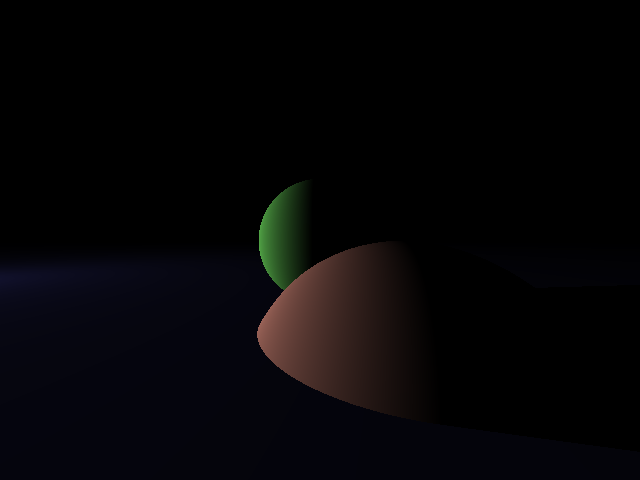
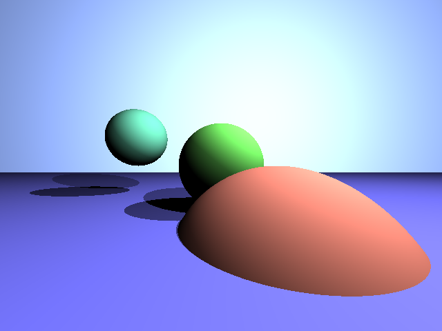

# RaytracerJava

This is the first real picture I got out of my raytracer:

Then I added shadows, so the whole scene got a lot darker:

So I also added a lightblue background and an extra light:

Next step is to implement different materials, such as glass for example.
